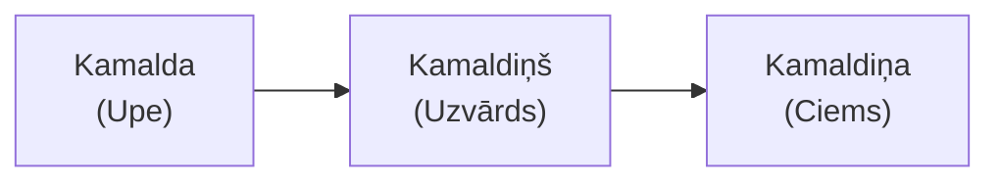

# Etimoloģija: Kamaldiņš


**Uzvārds kā Ģeogrāfiska Koordināte**


Uzvārds **Kamaldiņš** nav vienkārši vārds — tas ir *lingvistisks artefakts*, kas saglabā ainavas vēsturi.

---

## Morfoloģiskā Struktūra

Vārds sastāv no diviem elementiem:

| Elements | Nozīme |
|:---------|:-------|
| **Kamald-** | Sakne, atvasināta no hidronīma *Kamalda* |
| **-iņš** | Piedēklis ar lokatīvu funkciju: "Tas, kas no..." |

**Kamaldiņš** burtiski tulkojams kā **"Tas, kas no Kamaldas"**.

---

## Kamaldiņš vs. Kamoliņš


**Svarīga Atšķirība**


Lai arī skan līdzīgi, šie uzvārdi ir **ģenealoģiski atšķirīgi**:

| Uzvārds | Izcelsme | Tips |
|:--------|:---------|:-----|
| **Kamoliņš** | No vārda *kamols* (bumba, sfēra) | Iesauka vai profesija (dzijas tinējs) |
| **Kamaldiņš** | No hidronīma *Kamalda* (upe) | Lokācijas uzvārds |

Pirmais ir aprakstošs (persona), bet otrais — ģeogrāfisks (vieta).

---

## Rekursīvā Toponīmija

Vārds ir demonstrējis unikālu dzīves ciklu — pārvietojoties no zemes uz cilvēkiem un atpakaļ uz zemi:

1.  **I Fāze (pirms 19. gs.):** Upe Kamalda (hidronīms).
2.  **II Fāze (19. gs.):** Kamaldiņu dzimta (antroponīms).
3.  **III Fāze (20./21. gs.):** Kamaldiņa ciems Smiltenes pagastā (toponīms).

Mūsdienu reģistros **Kamaldiņa** ir ne tikai upes, bet arī apdzīvotas vietas (vasarnīcu ciema) nosaukums Smiltenē. Tas liecina, ka dzimtas klātbūtne bija pietiekami nozīmīga, lai apmetne tiktu nosaukta dzimtas vārdā.

---

## Infrastruktūras Pēdas

Vārds ieguva oficiālu statusu ne tikai kā uzvārds, bet arī kā valstiski nozīmīgs objekts:

*   **1928. gadā** dzelzceļa stacija "Lohre" (līnija Rīga-Valka) tika pārdēvēta par **"Kamalda"**.
*   Tas bija daļa no latviskošanas viļņa, kurā vāciskos nosaukumus aizstāja ar vietējiem hidronīmiem.
*   Diemžēl stacijas ēka gāja bojā ugunsgrēkā **2015. gadā**, taču nosaukums saglabājies vēsturiskajos sarakstos un kartēs.
